# Architecture: Event-Guided Video Frame Interpolation

## The Problem

Standard cameras capture frames at fixed intervals — typically 30 fps. Between any two frames, the world keeps moving, but the camera sees nothing. Video frame interpolation tries to reconstruct those missing in-between frames.

The naive approach — averaging two frames — produces ghosting. Smarter RGB-only methods estimate optical flow to warp frames to the target time, but they struggle when motion is fast or non-linear, because two snapshots 33ms apart simply don't contain enough temporal information.

**Our key insight:** event cameras change the game. Unlike standard cameras that capture full frames at fixed intervals, event cameras fire independently at each pixel the instant brightness changes, with microsecond resolution. They give us a continuous motion trail between frames — exactly the information that RGB alone is missing.

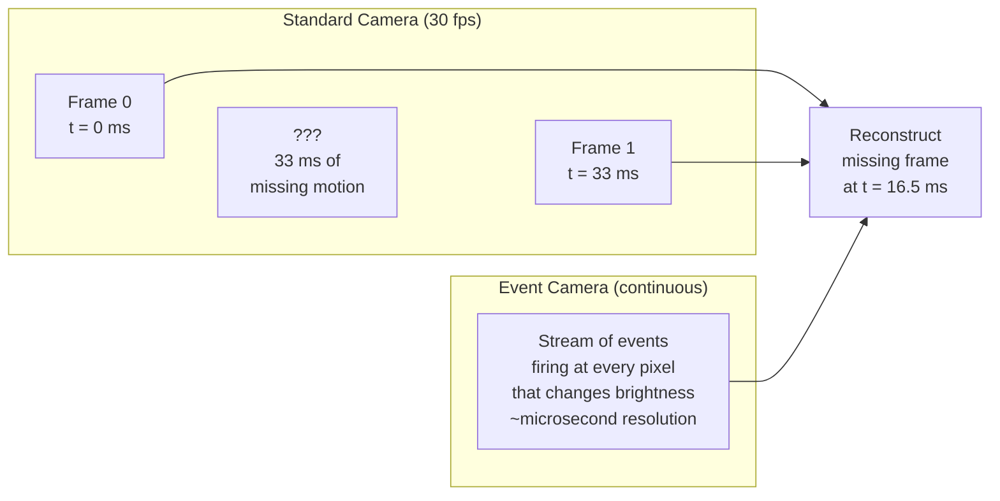

---

## The Data

### Vimeo-90k Triplets + Simulated Events

We train on **Vimeo-90k**, a standard benchmark for frame interpolation. Each sample is a triplet of consecutive frames (im1, im2, im3) at 448x256. Frame im2 is the ground truth; im1 and im3 are the input boundary frames.

**Event simulation:** Real paired event+frame datasets are rare and small. Instead, we use **v2e** (video-to-events), an established simulator that converts frame sequences into realistic event streams by modeling contrast thresholds, noise, and temporal dynamics. For each triplet, v2e generates a stream of events between im1 and im3.

### The Event Voxel Grid

Raw events are a sparse, asynchronous stream: `(x, y, timestamp, polarity)`. Neural networks need dense tensors. We convert events into a **5-bin voxel grid** — a tensor of shape `(5, H, W)` that discretizes the time interval between frames into 5 equal bins.

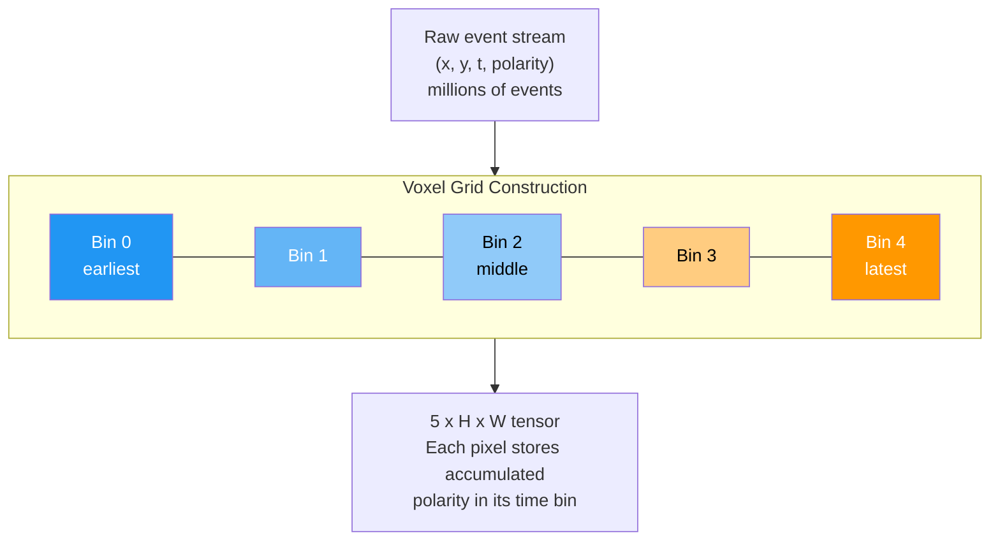

Each bin accumulates the signed polarity (+1 for brightness increase, -1 for decrease) of events falling in that time window. The result:

- **Where** motion happened (non-zero pixels)
- **When** during the interval it happened (which bins are active)
- **Direction** of brightness change (sign)

This is the information that two static RGB frames fundamentally cannot provide.

### Data Pipeline

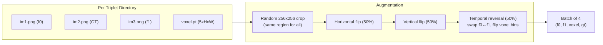

Temporal reversal is critical — it swaps the two input frames and reverses the voxel bin order, effectively asking the model to interpolate "backwards." This doubles effective dataset size and prevents the model from learning a directional bias.

---

## Architecture Evolution

We built four architectures, each addressing a specific limitation of the previous one. This wasn't just iteration — each design tests a different hypothesis about how to best combine events with RGB.

### Model Overview

| Model | Approach | Events Used? | Params | Key Idea |
|---|---|---|---|---|
| **RGBBaselineUNet** | Direct synthesis | No | 7.8M | Ablation control — what can RGB alone do? |
| **DualEncoderUNet** | Direct synthesis | Yes (dual encoder) | 7.8M | Do events help when fused with RGB features? |
| **EventWarpNet** | Flow-based | Yes (flow + refine) | 10.7M | Can events improve motion estimation? |
| **EventWarpNetV2** | Flow-based + attention | Yes (flow + attention) | 16.8M | Can events guide WHERE the model pays attention? |

---

## Architecture 1: RGBBaselineUNet

**Purpose:** Ablation baseline. Establishes what's achievable with RGB alone, so we can measure the exact contribution of event data.

**Approach:** Direct synthesis — the network directly regresses the output pixel values from input frames. No explicit motion estimation.

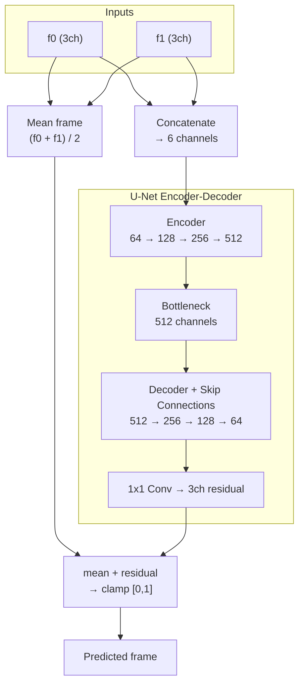

**Key design choice — residual learning:** Instead of predicting the output frame from scratch, the network predicts a *residual* (correction) that gets added to the mean of the two input frames. This is much easier to learn because the mean frame is already a rough approximation — the network only needs to fix the parts where averaging fails (motion boundaries, occluded regions).

**Building blocks:** Each encoder/decoder level uses `DoubleConv` — two consecutive (Conv3x3 → GroupNorm → ReLU) blocks. GroupNorm instead of BatchNorm because our batch size is small (4) and GroupNorm is invariant to batch size. Downsampling is MaxPool2d; upsampling is bilinear interpolation.

---

## Architecture 2: DualEncoderUNet

**Purpose:** Test whether event data provides useful information beyond what RGB contains. Same parameter budget as the baseline — the only difference is that events are now available.

**Approach:** Two parallel encoders (one for RGB, one for events) that fuse at every scale via learned 1x1 convolutions, feeding into a shared decoder.

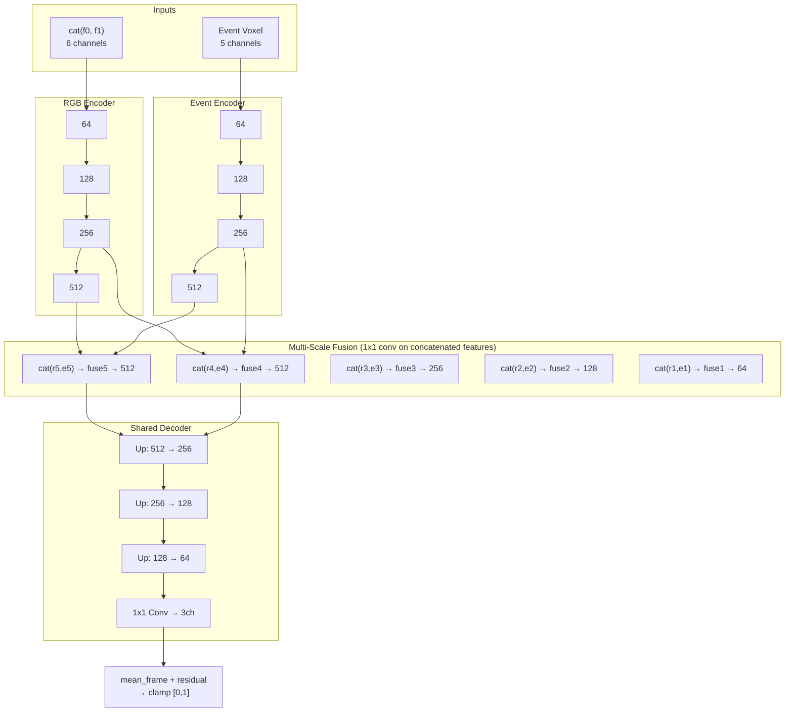

**Why multi-scale fusion?** Events and RGB are complementary at different spatial scales. At coarse scales, events capture large global motions. At fine scales, events delineate precise motion boundaries. Fusing at every encoder level lets the network combine these signals where they're most useful, rather than forcing all fusion through a single bottleneck.

**The ablation:** We run this model in three configurations:
1. **RGB Baseline** — no event encoder at all (Architecture 1)
2. **DualEncoder with zero events** — events are replaced with zeros, but the event encoder still exists. This controls for the extra parameters — if performance improves, it's not just because we added more weights.
3. **DualEncoder with real events** — the full model

If (3) > (2) > (1), events genuinely help. If (3) ≈ (2), the model is ignoring events and the extra encoder is just adding capacity.

---

## Architecture 3: EventWarpNet

**Purpose:** Shift from direct synthesis to flow-based interpolation. Instead of hallucinating pixels, explicitly estimate how they moved and then warp the input frames to the target time.

**Hypothesis:** Events encode motion trajectories. A flow-based approach can directly leverage this — the network estimates *where things moved*, and geometry handles the rest.

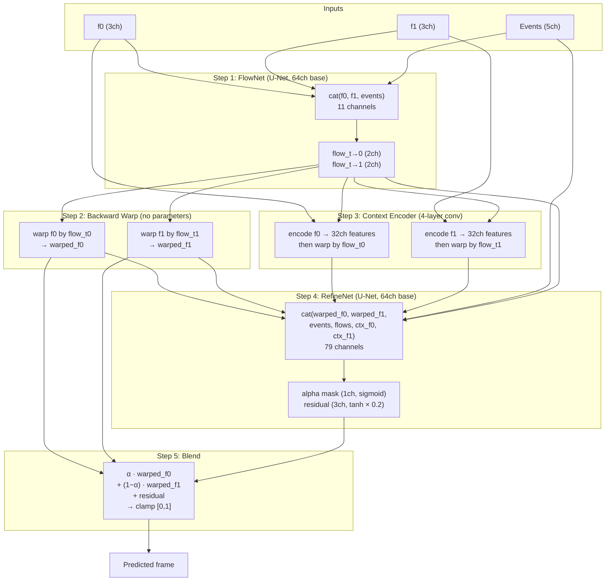

### How the pieces work together

**FlowNet** takes all three inputs (f0, f1, events) and estimates bidirectional optical flow — `flow_t0` says "for each pixel at target time t, where did it come from in f0?" and `flow_t1` does the same for f1.

**Backward warping** is a deterministic geometric operation (no learned parameters). For each pixel in the output, it looks up the source pixel in f0/f1 using the flow vectors and samples with bilinear interpolation. This produces `warped_f0` and `warped_f1` — the input frames "slid" to the target time.

**Context Encoder** extracts 32-channel texture features from f0 and f1, which are also warped to the target time. This gives RefineNet richer information than raw RGB — texture patterns, edge structures — that bilinear warping tends to blur. Inspired by DAIN's context extraction.

**RefineNet** receives everything — warped frames, warped context features, original events, and the flow fields themselves — and predicts:
- An **alpha mask** (sigmoid, 0–1): per-pixel blending weight between warped_f0 and warped_f1. When a region is occluded in one frame, alpha shifts to trust the other frame.
- A **bounded residual** (tanh × 0.2): additive correction for pixels that warping couldn't fix. The 0.2 bound prevents training instability — the network can't rely on huge residuals as a crutch.

**Final blend:** `pred = α · warped_f0 + (1−α) · warped_f1 + residual`

---

## Architecture 4: EventWarpNetV2

**Purpose:** Our best model. Addresses two limitations of EventWarpNet:

1. **Flow estimation is monolithic** — a single network tries to estimate flow from mixed RGB+event input. Events are good at capturing fast, coarse motion but bad at precise boundaries. RGB is the opposite. Forcing one network to handle both is suboptimal.

2. **Events are underused in refinement** — RefineNet sees events as just another input channel, but doesn't structurally prioritize event-dense regions (where motion is happening and correction matters most).

### Two-Stage Flow: Events First, RGB Refines

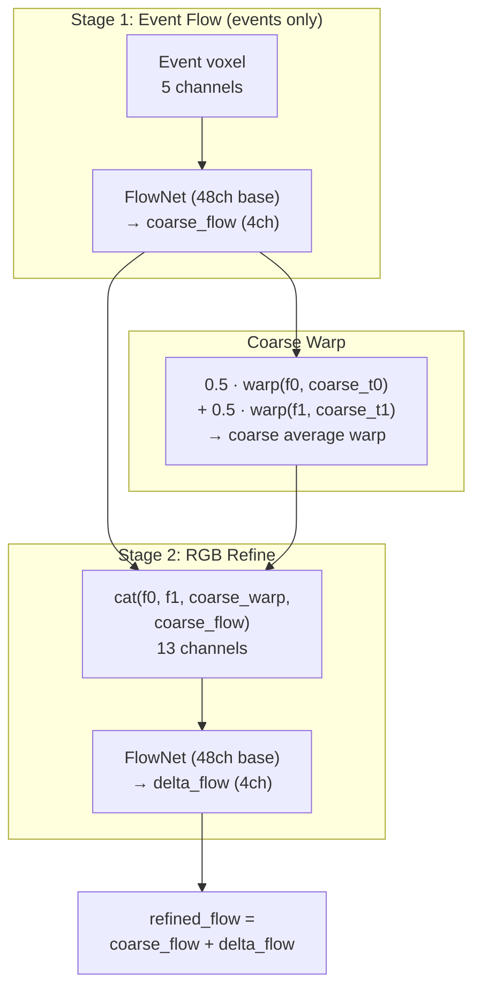

**Why two stages?** This decomposition reflects the actual strengths of each modality:
- **Events** know about fast, global motion (a car passing, a hand waving) but don't know about appearance boundaries or textures
- **RGB** knows about precise edges and textures but can't resolve fast motion between two snapshots

Stage 1 gives a "rough draft" of the motion field from events alone. Stage 2 sees the original frames plus the coarse warp result, and learns a residual correction (`delta_flow`) to refine edges and fix misalignments. The final flow is `coarse + delta`.

### Event Attention Gates

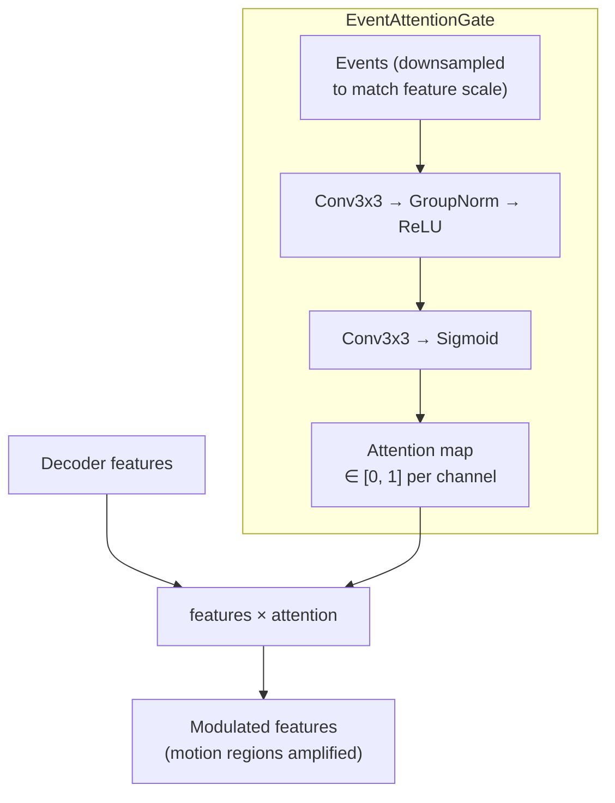

The **AttentiveRefineNet** inserts an EventAttentionGate at each decoder level (3 scales). At each scale, events are downsampled to match the feature map resolution, then converted to a spatial attention mask via `Conv → GroupNorm → ReLU → Conv → Sigmoid`.

**Bias initialization trick:** The second conv's bias is initialized to +1.5, so `sigmoid(1.5) ≈ 0.82`. This means the gate starts near identity (letting everything through) and learns to *suppress* static regions rather than having to learn to *activate* motion regions from scratch. This prevents early training collapse where the gate blocks all gradient flow.

The attention maps end up correlating strongly with event density — the network automatically learns to focus refinement effort on regions where motion actually happened and where correction is most needed.

### Full EventWarpNetV2 Pipeline

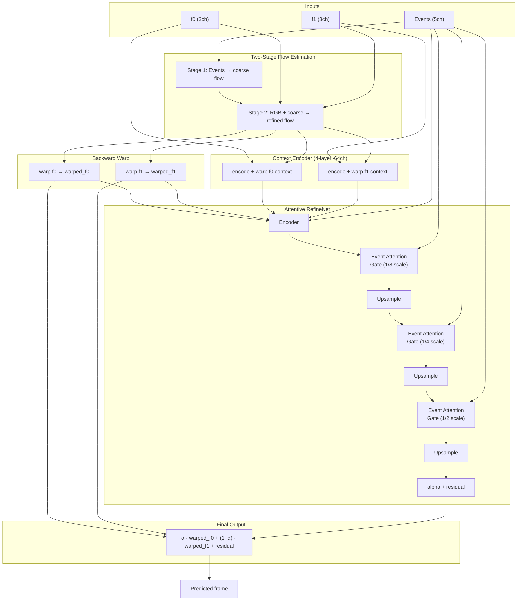

---

## Loss Functions

Training uses a composite loss that supervises different aspects of the output:

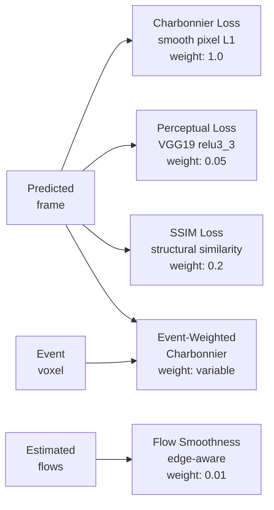

| Loss | Formula | Purpose |
|---|---|---|
| **Charbonnier** | `√(diff² + ε²)` | Pixel reconstruction. Smooth L1 — robust to outliers, doesn't over-penalize large errors like MSE |
| **Perceptual** | `L1(VGG(pred), VGG(gt))` | Feature-space similarity via frozen VGG19. Prevents blurry outputs by comparing high-level structure, not individual pixels |
| **SSIM** | `1 - SSIM(pred, gt)` | Structural similarity — preserves edges, contrast, and luminance patterns that humans notice |
| **Flow Smoothness** | `exp(-|∇img|) · |∇flow|` | Regularizes flow fields. Penalizes jitter everywhere, but relaxes near image edges where large flow gradients are expected |
| **Event-Weighted Charb** | `(1 + α·density) · charb` | Upweights loss in motion regions (high event density). Forces the model to actually use event data instead of defaulting to the safe mean-frame prediction |

### Coarse Flow Supervision (EventWarpNetV2 only)

For the two-stage flow model, we add an auxiliary loss on the coarse (events-only) flow:

```
loss += 0.25 × Charbonnier(coarse_warp, gt)
```

This ensures Stage 1 learns meaningful flow from events alone, rather than producing garbage that Stage 2 has to completely overwrite. The 0.25 weight lets coarse flow be approximate — it doesn't need to be perfect, just a reasonable starting point.

---

## Training Setup

| Setting | Value |
|---|---|
| **Optimizer** | AdamW, lr=1e-4, weight_decay=1e-4 |
| **Scheduler** | 5-epoch linear warmup → cosine annealing to 1e-6 |
| **Batch size** | 4 |
| **Crop size** | 256×256 |
| **Gradient clipping** | max_norm=5.0 |
| **Mixed precision** | FP16 via torch.amp |
| **Hardware** | Google Colab Pro, NVIDIA T4 (16GB) |
| **Dataset** | Vimeo-90k triplets, 90/10 train/val split (seed 42) |

---

## The Ablation Story

The progression of architectures tells a clear experimental narrative:

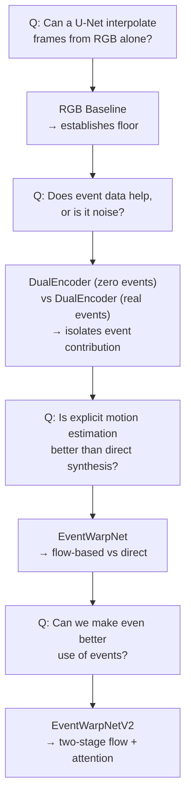

1. **RGBBaselineUNet** answers: "What's the baseline without events?" This is the control.

2. **DualEncoderUNet** with real vs. zero events answers: "Do events actually help, or is the improvement just from extra model capacity?" If zero-events performance equals real-events performance, events are useless. If there's a gap, events provide genuine signal.

3. **EventWarpNet** answers: "Is it better to explicitly model motion (flow + warp) rather than hallucinate pixels?" Flow-based approaches have a structural advantage — they decompose the problem into motion estimation (geometric) and appearance synthesis (photometric).

4. **EventWarpNetV2** answers: "Can we use events more effectively?" Two-stage flow lets events handle what they're best at (coarse motion) while RGB handles what it's best at (fine boundaries). Attention gates let the model dynamically focus on motion regions instead of treating every pixel equally.

---

## Parameter Counts

| Component | RGBBaseline | DualEncoder | EventWarpNet | EventWarpNetV2 |
|---|---|---|---|---|
| RGB Encoder | 7.8M | 3.9M | — | — |
| Event Encoder | — | 3.9M | — | — |
| Fusion layers | — | ~0.3M | — | — |
| Decoder | (shared) | (shared) | — | — |
| FlowNet | — | — | 7.7M | — |
| TwoStageFlowNet | — | — | — | 7.6M |
| ContextEncoder | — | — | 18K | 70K |
| RefineNet | — | — | 3.0M | — |
| AttentiveRefineNet | — | — | — | 3.2M |
| Attention Gates | — | — | — | ~50K |
| **Total** | **7.8M** | **7.8M** | **10.7M** | **16.8M** |
